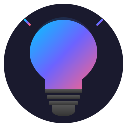

# ioBroker.govee-smart

Control all [Govee](https://www.govee.com/) WiFi products from ioBroker — lights, sensors and appliances. Bluetooth-only devices are not supported.

The adapter uses every channel Govee offers and picks whichever delivers the fastest, most reliable answer:

- **LAN** (UDP) — primary for lights with LAN mode enabled
- **AWS IoT MQTT** — real-time status push when you supply your Govee account
- **OpenAPI MQTT** — push events for sensors and appliances (lackWater, iceFull etc.)
- **Cloud REST v2** — capabilities, scenes, control fallback
- **App API** — sensor readings (Govee's OpenAPI v2 returns empty for thermometers, the App API doesn't)

The Wiki lists every supported model and its test status:

- [Devices (English)](https://github.com/krobipd/ioBroker.govee-smart/wiki/Devices)
- [Geräte (Deutsch)](https://github.com/krobipd/ioBroker.govee-smart/wiki/Geraete)

---

## Documentation

Full user documentation lives in the **[Wiki](https://github.com/krobipd/ioBroker.govee-smart/wiki)**.

| Topic                                                                       | English                                                                                               | Deutsch                                                                                                 |
| --------------------------------------------------------------------------- | ----------------------------------------------------------------------------------------------------- | ------------------------------------------------------------------------------------------------------- |
| Landing page                                                                | [Home](https://github.com/krobipd/ioBroker.govee-smart/wiki/Home)                                     | [Startseite](https://github.com/krobipd/ioBroker.govee-smart/wiki/Startseite)                           |
| Channels, credentials, API key, experimental devices                        | [Setup](https://github.com/krobipd/ioBroker.govee-smart/wiki/Setup)                                   | [Einrichtung](https://github.com/krobipd/ioBroker.govee-smart/wiki/Einrichtung)                         |
| Supported models, status meanings, contributing yours                       | [Devices](https://github.com/krobipd/ioBroker.govee-smart/wiki/Devices)                               | [Geräte](https://github.com/krobipd/ioBroker.govee-smart/wiki/Geraete)                                  |
| Thermometers, heaters, kettles, etc. — state tree, updates, troubleshooting | [Sensors and Appliances](https://github.com/krobipd/ioBroker.govee-smart/wiki/Sensors-and-Appliances) | [Sensoren und Appliances](https://github.com/krobipd/ioBroker.govee-smart/wiki/Sensoren-und-Appliances) |
| Lights — segment count, wizard, cut strips, batch commands                  | [Segments](https://github.com/krobipd/ioBroker.govee-smart/wiki/Segments)                             | [Segmente](https://github.com/krobipd/ioBroker.govee-smart/wiki/Segmente)                               |
| Lights — scene library, speed slider, Cloud vs local snapshots              | [Scenes and Snapshots](https://github.com/krobipd/ioBroker.govee-smart/wiki/Scenes-and-Snapshots)     | [Szenen und Snapshots](https://github.com/krobipd/ioBroker.govee-smart/wiki/Szenen-und-Snapshots)       |
| Lights — group fan-out, capability intersection                             | [Groups](https://github.com/krobipd/ioBroker.govee-smart/wiki/Groups)                                 | [Gruppen](https://github.com/krobipd/ioBroker.govee-smart/wiki/Gruppen)                                 |
| Folder naming, startup, diagnostics, troubleshooting                        | [Behavior](https://github.com/krobipd/ioBroker.govee-smart/wiki/Behavior)                             | [Verhalten](https://github.com/krobipd/ioBroker.govee-smart/wiki/Verhalten)                             |

---

## Features

- **Capability-driven** — states are generated from what the Govee API reports for each device. No SKU hardcoding, no hand-maintained device list to fall behind.
- **LAN-first for lights** — UDP multicast discovery, sub-50 ms commands, status updates via AWS IoT MQTT
- **Cloud + MQTT push for sensors and appliances** — readings via the App API, events via the OpenAPI MQTT broker
- **Per-segment color and brightness** for LED strips with the right capability, including batch commands and an interactive segment detection wizard for cut strips
- **Scenes, DIY scenes, music mode, gradient toggle** — activated locally via BLE-over-LAN where possible, Cloud fallback otherwise
- **Cloud and local snapshots** — Govee-app snapshots and ioBroker-side snapshots side by side
- **Groups** — bridge Govee groups into ioBroker with capability intersection across members
- **Diagnostics export button per device** — one-click JSON dump for bug reports
- **Graceful degradation** — works LAN-only without any credentials; each tier unlocks more
- **Rate-limited Cloud usage** — daily and per-minute budgets aligned to Govee's quota

---

## Requirements

- Node.js >= 20
- ioBroker js-controller >= 7.0.7
- ioBroker Admin >= 7.7.22
- A Govee account and at least one Govee WiFi device. LAN control needs a light with LAN mode enabled in the Govee Home app — see Govee's [LAN-supported device list](https://app-h5.govee.com/user-manual/wlan-guide).

---

## Credential levels

| Level               | Credentials      | What works                                                                                                                                       |
| ------------------- | ---------------- | ------------------------------------------------------------------------------------------------------------------------------------------------ |
| **LAN only**        | none             | Lights with LAN mode: power, brightness, color, color temperature, local snapshots                                                               |
| **+ Cloud API key** | API key          | + device names, capabilities, scenes, segments, Cloud snapshots, basic groups, sensor and appliance readings, push events for sensors/appliances |
| **+ Govee account** | email + password | + real-time status push for lights via AWS IoT MQTT, full group control                                                                          |

Sensors and appliances always need at least the API key — they have no LAN protocol. See the [Setup page](https://github.com/krobipd/ioBroker.govee-smart/wiki/Setup) for how to get one.

---

## Ports

| Port | Protocol | Direction                            | Purpose              |
| ---- | -------- | ------------------------------------ | -------------------- |
| 4001 | UDP      | Outbound (multicast 239.255.255.250) | LAN device discovery |
| 4002 | UDP      | Inbound                              | LAN device responses |
| 4003 | UDP      | Outbound                             | LAN device commands  |

All ports are fixed by the Govee LAN protocol and cannot be changed.

---

## Device tiers

Each device exposes its trust tier in `info.diagnostics_tier`:

| Tier         | Meaning                                                                                                                            |
| ------------ | ---------------------------------------------------------------------------------------------------------------------------------- |
| **verified** | Confirmed on real hardware — full per-SKU corrections active.                                                                      |
| **reported** | Community-reported, treated as verified.                                                                                           |
| **seed**     | Beta. Per-SKU corrections only apply when **Experimentelle Geräte-Unterstützung aktivieren** is on in adapter settings.            |
| **unknown**  | The SKU isn't in the catalogue yet. Press `info.diagnostics_export` and post the resulting JSON in a GitHub issue so it can be added. |

The adapter logs one nudge per SKU per startup for `seed` (without the toggle) and `unknown`, so reconnects don't spam the log.

---

## Troubleshooting

Common issues (no devices discovered, empty scenes dropdown, segment colors not changing, limited group commands, delayed status updates) are covered on the Wiki [Behavior](https://github.com/krobipd/ioBroker.govee-smart/wiki/Behavior) / [Verhalten](https://github.com/krobipd/ioBroker.govee-smart/wiki/Verhalten) page.

For anything else, press **`info.diagnostics_export`** on the affected device, copy the JSON from `info.diagnostics_result`, and open a [GitHub Issue](https://github.com/krobipd/ioBroker.govee-smart/issues).

---

## Acknowledgments

This adapter's MQTT authentication and BLE-over-LAN (ptReal) protocol implementation was informed by research from [govee2mqtt](https://github.com/wez/govee2mqtt) by Wez Furlong. Their reverse-engineering of the Govee AWS IoT MQTT protocol and undocumented API endpoints was invaluable.

---

## Changelog

### **WORK IN PROGRESS**

- 2FA login flow for Govee accounts that require email verification — adapter settings expose a verification-code button + field; the code is consumed on the next login and cleared automatically.
- MQTT credentials are persisted across restarts so the verification email is not re-sent on every reboot, with a proactive refresh shortly before the token expires.
- Stable AWS-IoT MQTT client ID across restarts — reconnects keep the same identity instead of looking like a fresh session each time.
- `info.online` is now updated for App-API sensors and OpenAPI-MQTT appliances. Fixes the H5179 thermometer staying at `info.online=false` while readings kept updating.
- New `info.diagnostics_tier` state per device — exposes the trust tier (verified / reported / seed / unknown). Unknown SKUs and seed-without-toggle now log a one-time warn nudge.
- Scene, DIY scene, and snapshot dropdowns are created from device capabilities — visible from the first start, even before the first `/device/scenes` call returns.
- `info.refresh_cloud_data` button refetches the scene/music/DIY libraries again (was skipped since v1.10.1).
- Min js-controller `>=7.0.7`, min admin `>=7.7.22`.

### 2.0.3 (2026-04-26)

- Min js-controller correction: was incorrectly bumped to `>=7.0.23` in 2.0.2 (and admin downgraded from `>=7.6.20` to `>=7.6.17`). The repochecker-recommended values are `>=6.0.11` / `>=7.6.20` — restored.

### 2.0.2 (2026-04-26)

- OpenAPI MQTT now keeps a stable client ID across reconnects (was `Date.now`-based, which Govee's broker treats as new connections).
- Stop shipping the `manual-review` release-script plugin and the redundant `@iobroker/types` runtime dep — adapter-only consequences.
- Bump min js-controller to `>=7.0.23` (matches latest-repo recommendation).
- Audit-driven boilerplate sync with the other krobi adapters (`.vscode` json5 schemas, dependabot assignees + github-actions ecosystem, `tsconfig.test` looser test rules).
- Repo hygiene: ignore `package/` (npm-pack artefact).

### 2.0.1 (2026-04-26)

- Sensor states route to `sensor/`, event states to `events/` (was `control/` for both); state objects are created lazily on first write to avoid `no existing object` warnings.
- Snapshots and scenes only attach to lights now; thermometers, heaters and kettles no longer get `snapshot_local` / `snapshot_save` / `snapshot_delete`.
- No more boot-time `N experimental device(s) detected` log dump — only triggers when an experimental SKU actually shows up, once per lifetime per SKU.
- Routine `OpenAPI MQTT connected for sensor events` info line removed; reconnect-recovery log kept.

### 2.0.0 (2026-04-26)

- Major release — Govee appliances and sensors (thermometers like H5179, heaters, kettles, ice makers) are now handled here alongside lights, via the App API and OpenAPI-MQTT push channel.
- The standalone `iobroker.govee-appliances` adapter is deprecated and rolls into here. Install govee-smart 2.0.0+ and uninstall govee-appliances when convenient.
- New **"Enable experimental device support"** checkbox in the adapter config. The Wiki [Devices](https://github.com/krobipd/ioBroker.govee-smart/wiki/Devices) page lists every SKU and its status.
- `devices.json` in the repo root tracks 36 SKUs and is the single source of truth for the Wiki and for runtime quirk overrides.
- New state `info.openapiMqttConnected` for the OpenAPI-MQTT channel; `info.mqttConnected` keeps tracking AWS IoT MQTT for lights.

### 1.11.0 (2026-04-25)

- Scene / DIY-scene / snapshot / music-mode dropdowns now accept index-as-number, index-as-string and the entry name (case-insensitive). The state type is `mixed` — no more `expects type string but received number` warning when scripts write a numeric index.
- Duplicate scene names from the cloud are auto-disambiguated with `" (2)"`, `" (3)"` suffixes; reverse-lookup is deterministic.
- The adapter acks back the canonical key after activation, so the dropdown stays in sync regardless of how the value was written.

## Support

- [Wiki](https://github.com/krobipd/ioBroker.govee-smart/wiki) — user documentation (EN / DE)
- [GitHub Issues](https://github.com/krobipd/ioBroker.govee-smart/issues) — bug reports, feature requests
- [ioBroker Forum](https://forum.iobroker.net/) — general questions

### Support Development

This adapter is free and open source. If you find it useful, consider buying me a coffee:

---

## License

MIT License

Copyright (c) 2026 krobi <krobi@power-dreams.com>

Permission is hereby granted, free of charge, to any person obtaining a copy
of this software and associated documentation files (the "Software"), to deal
in the Software without restriction, including without limitation the rights
to use, copy, modify, merge, publish, distribute, sublicense, and/or sell
copies of the Software, and to permit persons to whom the Software is
furnished to do so, subject to the following conditions:

The above copyright notice and this permission notice shall be included in all
copies or substantial portions of the Software.

THE SOFTWARE IS PROVIDED "AS IS", WITHOUT WARRANTY OF ANY KIND, EXPRESS OR
IMPLIED, INCLUDING BUT NOT LIMITED TO THE WARRANTIES OF MERCHANTABILITY,
FITNESS FOR A PARTICULAR PURPOSE AND NONINFRINGEMENT. IN NO EVENT SHALL THE
AUTHORS OR COPYRIGHT HOLDERS BE LIABLE FOR ANY CLAIM, DAMAGES OR OTHER
LIABILITY, WHETHER IN AN ACTION OF CONTRACT, TORT OR OTHERWISE, ARISING FROM,
OUT OF OR IN CONNECTION WITH THE SOFTWARE OR THE USE OR OTHER DEALINGS IN THE
SOFTWARE.

---

_Developed with assistance from Claude.ai_
